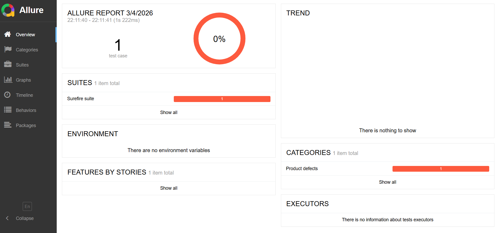
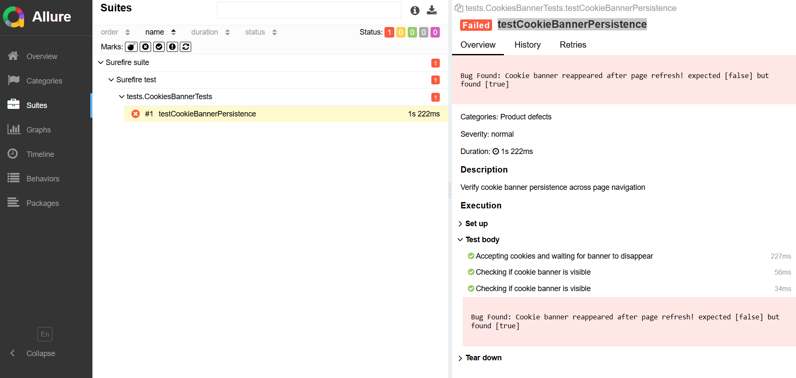
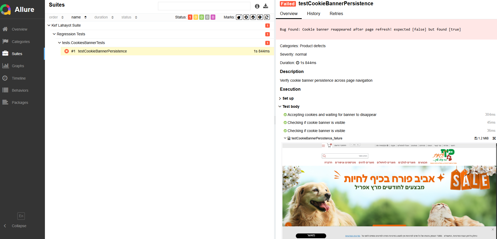

# 🐾 Kef-La-Hayot: Professional E2E Automation & QA Strategy

### 🌟 Executive Summary
This project is a comprehensive automation and manual testing suite for the "Kef-La-Hayot" e-commerce platform. It demonstrates a full QA lifecycle—from strategic planning (STP) to automated execution and executive reporting (STR).

**Key Achievement:** Discovery of **13 significant defects**, including a critical legal compliance blocker and high-risk data integrity issues.

---

### 📊 Project Insights & Presentation
> [!IMPORTANT]
> **[📊 Click here to view the Interactive Project Presentation (STR)](https://docs.google.com/presentation/d/e/2PACX-1vTOF0UBZ5-NZYzlSUIyLPEaatsvW49CcG2ed1wF7Y3-O2SgaMuk_LUQ-zeYnDGO3-jr_kpn8P363piL/pub?start=true&loop=false&delayms=10000&slide=id.p)** > *Includes full bug analysis, risk assessment, and the final GO/NO-GO decision.*

> **[🎥 Watch the Automation Video Demo](https://www.canva.com/design/DAHDwmFgX7s/S8T6Vkwk4g0_rniwiU45IQ/watch?utm_content=DAHDwmFgX7s&utm_campaign=designshare&utm_medium=link2&utm_source=uniquelinks&utlId=hb7d1ac700b)** > *Full execution simulation showing real-time bug detection.*

---

### 🐞 Top Critical Findings (The "Money Shot")
Automation discovered 13 functional and UI/UX defects. Below are the top 3 critical issues, captured via automated screenshots with custom highlighting:

#### **1. Bug-06: T&C Acceptance Bypass (Blocker)**
*The system allows registration without legal consent, creating severe compliance risk.* 

#### **2. Bug-07: Duplicate Phone Registration (Critical)**
*Failure in data integrity validation allowing multiple accounts for the same number.* 

#### **3. Bug-12: Content Rendering Failure (Major)**
*Broken UI layout and empty sections leading to high user friction.* 

> [!TIP]
> Each bug report includes a high-resolution screenshot with **blue-border highlighting** (via `HighlightUtils`) for immediate visual identification.

---

### 🎞️ Test Evidence & Reporting

#### 📊 Allure Reporting Dashboard
I configured Allure to provide professional, multi-layered evidence for every execution:
* **Visual Logs:** Automated screenshots for every failure.
* **Failure Analysis:** Statistical distribution of defects by severity.
* **Environment Metadata:** Browser, OS, and timestamp tracking.

| Dashboard Overview | Execution Flow | Failure Trace |
| :---: | :---: | :---: |
|  |  |  |

---

### 🚀 Tech Stack & Architecture
* **Hybrid Framework:** Built with **Java 17**, **Selenium WebDriver**, and **TestNG**.
* **Page Object Model (POM):** Ensuring clean, maintainable, and scalable code.
* **Advanced Capturing:** Integrated **CDP (Chrome DevTools Protocol)** for full-page evidence.
* **Build Tool:** **Maven** for dependency management and lifecycle control.

---

### 🔧 How to Run
1. **Clone the repository:**
   ```bash
   git clone [https://github.com/ItzhakLevy1/kef-la-hayot-automation.git](https://github.com/ItzhakLevy1/kef-la-hayot-automation.git)
   cd kef-la-hayot-automation